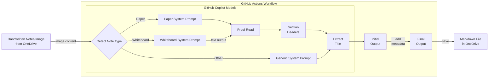

# Handwriting-to-Markdown Workflow

> Automatically convert handwritten notes from OneDrive into Markdown using AI-powered OCR. Runs on GitHub Actions with zero infrastructure costs.

## Executive Summary

This GitHub Actions workflow automatically processes handwritten notes from your OneDrive folder and converts them into well-formatted Markdown files using GitHub Copilot Models (default: GPT-4.1). Simply drop images or PDFs into a OneDrive folder, and the workflow will:

- Detect note types (paper, whiteboard, or generic)
- Extract text with specialized OCR prompts
- Proofread and correct errors (for paper and whiteboard notes)
- Add section headers and extract titles
- Save markdown files with embedded images
- Organize processed files automatically

**Key Benefits:**
- ✅ **Free** for public repositories (GitHub Actions minutes for private repos)
- ✅ **No infrastructure** to manage - fully serverless
- ✅ **Intelligent processing** with note-type detection and specialized prompts
- ✅ **Automatic scheduling** - runs every 15 minutes from 8am-11pm UTC+8, on push to main, or on-demand
- ✅ **Obsidian-compatible** output format

> [!NOTE]
> This project is the next iteration of [Handwriting-to-Markdown-GPT](https://github.com/raffertyuy/Handwriting-to-Markdown-GPT/tree/main). Unlike the original, which relied on Azure Logic Apps, Azure Functions, and Azure AI, this version requires only GitHub Copilot Models, making it simpler and more cost-effective.

## Getting Started

### Quick Setup (5 minutes)

1. **Prepare environment file** (30 sec)
   ```bash
   # Copy the example file
   cp app/.env.example app/.env
   ```

2. **Create Azure AD App** (2 min)
   - Go to [Azure Portal](https://portal.azure.com) → **Azure Active Directory** → **App registrations** → **New registration**
   - Name: "Handwritten Notes OneDrive"
   - Supported accounts: **Personal Microsoft accounts** (or "Accounts in any organizational directory and personal Microsoft accounts")
   - Copy the **Application (client) ID** and add it to `app/.env` as `ONEDRIVE_CLIENT_ID`
   - ⓘ This is free and doesn't require an Azure subscription - it's just for API authentication

3. **Configure Permissions** (1 min)
   - **API permissions** → **Add a permission** → **Microsoft Graph** → **Delegated permissions**
   - Add: `Files.ReadWrite` and `offline_access`
   - Click **Grant admin consent** (if available)

4. **Create Client Secret** (1 min)
   - **Certificates & secrets** → **New client secret**
   - **Copy the Value immediately** (you won't see it again) and add it to `app/.env` as `ONEDRIVE_CLIENT_SECRET`

5. **Get Refresh Token** (1 min)
   ```bash
   # Install dependencies and run the script
   pip install -r app/requirements.txt
   python app/get_refresh_token.py
   ```
   The script will read your credentials from `app/.env`, open a browser for authorization, and display your refresh token. Copy the refresh token and add it to `app/.env` as `ONEDRIVE_REFRESH_TOKEN`.

6. **Create GitHub Personal Access Token** (1 min)
   - Go to GitHub.com → Settings → Developer settings → Personal access tokens → Tokens (classic)
   - Click "Generate new token (classic)"
   - Select the **`copilot`** scope (required for GitHub Copilot Models API access)
   - Generate and copy the token

7. **Configure GitHub Secrets**
   - Go to your repo → **Settings** → **Secrets and variables** → **Actions** → **New repository secret**
   - Add:
     - `ONEDRIVE_CLIENT_ID` - Your Application (client) ID
     - `ONEDRIVE_CLIENT_SECRET` - Your client secret value
     - `ONEDRIVE_REFRESH_TOKEN` - The refresh token from step 5
     - `GH_PAT` - Your GitHub Personal Access Token with 'copilot' scope

8. **Test the Workflow**
   - Go to **Actions** tab → **Process Handwritten Notes** → **Run workflow**

The workflow runs automatically:
- Every 15 minutes from 8am to 11pm UTC+8 (midnight to 3pm UTC)
- On every push to the main branch
- Manually from the Actions tab

## How It Works



### Processing Pipeline

1. **Scheduled Trigger**: Runs every 15 minutes from 8am-11pm UTC+8, on push to main branch, or manually
2. **File Detection**: Checks OneDrive for new files in the source folder
3. **File Type Validation**: Supports JPG, JPEG, PNG, GIF, BMP, TIFF, and PDF
4. **PDF Conversion**: Converts PDFs to JPEG (first page only)
5. **AI Processing**: Uses GitHub Copilot Models to:
   - Detect note type (PAPER, WHITEBOARD, OTHER)
   - Extract text with specialized OCR prompts
   - Proofread and fix errors (for PAPER and WHITEBOARD only)
   - Add section headers (for PAPER and WHITEBOARD only)
   - Extract main title
6. **File Management**: 
   - Creates markdown file in destination folder
   - Copies image to destination folder
   - Moves original to processed folder

## Detailed Setup

### Prerequisites

- **GitHub Account with Copilot Models Access**: Your GitHub account needs access to GitHub Copilot Models
- **Microsoft Azure AD App Registration**: Required for OneDrive API access (free, no Azure subscription needed)
- **GitHub Repository**: This repository with the workflow files

> **Note**: Azure AD App Registration is free and doesn't require an Azure subscription. It's Microsoft's identity platform (now called Microsoft Entra ID) and is required to access OneDrive (personal or business) via the Microsoft Graph API.

### Step-by-Step Setup

#### 1. Create Azure AD App Registration

1. Go to [Azure Portal](https://portal.azure.com)
2. Navigate to **Azure Active Directory** → **App registrations**
3. Click **New registration**
4. Name it (e.g., "Handwritten Notes OneDrive")
5. Select **Accounts in any organizational directory and personal Microsoft accounts**
6. Click **Register**
7. Note down the **Application (client) ID**

#### 2. Configure API Permissions

1. In your app registration, go to **API permissions**
2. Click **Add a permission**
3. Select **Microsoft Graph**
4. Choose **Delegated permissions**
5. Add the following permissions:
   - `Files.ReadWrite` (read and write files in OneDrive)
   - `offline_access` (get refresh tokens)
6. Click **Add permissions**
7. Click **Grant admin consent** (if you're an admin) or consent when prompted

#### 3. Create Client Secret

1. In your app registration, go to **Certificates & secrets**
2. Click **New client secret**
3. Add a description and set expiration
4. Click **Add**
5. **IMPORTANT**: Copy the secret value immediately (you won't see it again)

#### 4. Get Refresh Token

Use the provided helper script:

```bash
# Copy the example file and add your credentials
cp app/.env.example app/.env
# Edit app/.env and add your ONEDRIVE_CLIENT_ID and ONEDRIVE_CLIENT_SECRET

# Install dependencies and run the script
pip install -r app/requirements.txt
python app/get_refresh_token.py
```

The script will:
- Read your Client ID and Client Secret from the `.env` file
- Open a browser for you to authorize the application
- Automatically exchange the authorization code for tokens
- Display your refresh token

**Alternative methods**:
- Use [OAuth 2.0 Playground](https://oauthplay.azurewebsites.net/)
- Use [Postman](https://www.postman.com/) with Microsoft Graph API collection

#### 5. Configure GitHub Secrets

Go to your GitHub repository → **Settings** → **Secrets and variables** → **Actions** → **New repository secret**

**Required secrets:**
- `ONEDRIVE_CLIENT_ID`: Your Azure AD Application (client) ID
- `ONEDRIVE_CLIENT_SECRET`: Your Azure AD client secret value
- `ONEDRIVE_REFRESH_TOKEN`: The refresh token from Step 4
- `GH_PAT`: GitHub Personal Access Token with 'copilot' scope (required for GitHub Copilot Models API)

**Optional secrets:**
- `GH_MODEL`: Model name, defaults to `openai/gpt-4.1`
- `GH_MODELS_URL`: GitHub Models API endpoint, defaults to `https://models.github.ai/inference`
- `ONEDRIVE_SOURCE_FOLDER`: Source folder path, defaults to `Handwritten Notes`
- `ONEDRIVE_DEST_FOLDER`: Destination folder path, defaults to `second-brain/second-brain/_scans`
- `ONEDRIVE_PROCESSED_FOLDER`: Processed files folder, defaults to `Handwritten Notes/processed`

**Note**: The default `github.token` in GitHub Actions doesn't have access to GitHub Copilot Models. You must use a Personal Access Token with the 'copilot' scope.

#### 6. Enable the Workflow

The workflow is already configured in `.github/workflows/process-handwritten-notes.yml`. It will run automatically:
- Every 15 minutes from 8am to 11pm UTC+8 (midnight to 3pm UTC)
- On every push to the main branch
- Manually from the **Actions** tab

## Architecture

### Component Overview

```
GitHub Actions Workflow (Scheduled Trigger)
    ↓
Python Script (process_notes.py)
    ├─ OneDriveClient (Microsoft Graph API)
    │   └─ Check for new files
    ├─ File Type Validation
    ├─ PDF Converter (pdf2image)
    ├─ NoteProcessor
    │   └─ GitHub Copilot Models (Text extraction)
    └─ OneDriveClient
        ├─ Save markdown + image
        └─ Move to processed folder
```

### Key Components

- **GitHub Actions Workflow**: Scheduled trigger (every 15 minutes from 8am-11pm UTC+8), on push to main, or manual
- **OneDrive Client**: Microsoft Graph API integration for file operations (requires Azure AD app registration)
- **Note Processor**: AI-powered text extraction with specialized prompts using GitHub Copilot Models
- **PDF Converter**: Converts PDF first page to JPEG
- **Post Processor**: Proofreading, section headers, title extraction

### Data Flow

1. OneDriveClient checks source folder for new files
2. File validation filters by supported extensions
3. File download from OneDrive
4. PDF conversion (if needed) to JPEG
5. AI processing extracts text with note-type-specific prompts
6. Post-processing: proofreading, section headers, title extraction
7. Upload markdown and image to destination folder
8. Move original file to processed folder

## Troubleshooting

### Workflow fails with authentication error

- Verify your `ONEDRIVE_CLIENT_ID`, `ONEDRIVE_CLIENT_SECRET`, and `ONEDRIVE_REFRESH_TOKEN` are correct
- **Refresh token maintenance**: Microsoft may issue a new refresh token during authentication. Check workflow logs for warnings about new tokens and update your GitHub secret if needed
- **Token expiration**: While regular use (hourly runs) should keep tokens valid indefinitely, if the workflow doesn't run for extended periods (e.g., if disabled for weeks), you may need to regenerate using `get_refresh_token.py`
- **Manual token refresh**: If authentication fails, regenerate the refresh token by running `python app/get_refresh_token.py` locally and updating the `ONEDRIVE_REFRESH_TOKEN` secret

### Important: Refresh Token Lifecycle

The OneDrive refresh token in your GitHub secret may need periodic updates:

1. **Automatic detection**: The workflow automatically detects when Microsoft issues a new refresh token and logs a warning with the new token value (masked in GitHub Actions logs for security)
2. **Regular usage keeps tokens alive**: Running the workflow hourly prevents token expiration due to inactivity
3. **When to update manually**:
   - If you see authentication errors in the workflow logs
   - If the workflow hasn't run for 90+ days (inactivity expiration)
   - If you see warnings about new refresh tokens in the logs
4. **How to update**: Run `python app/get_refresh_token.py` locally and update the `ONEDRIVE_REFRESH_TOKEN` secret in your repository settings

### Workflow fails with GitHub Models error

- Verify your GitHub account has access to GitHub Copilot Models
- Check that `GH_PAT` secret is set with a valid Personal Access Token that has 'copilot' scope
- Ensure your account has the necessary permissions for GitHub Models API

### Files not being processed

- Check that files are in the correct OneDrive folder
- Verify file extensions are supported (JPG, JPEG, PNG, GIF, BMP, TIFF, PDF)
- Check workflow logs for specific error messages
- Ensure files are not already in the processed folder

### PDF conversion fails

- Ensure poppler-utils is installed (handled automatically in workflow)
- Check that PDF is not corrupted

## Manual Testing

You can test the workflow locally:

1. **Install dependencies:**
   ```bash
   pip install -r app/requirements.txt
   sudo apt-get install poppler-utils  # On Linux
   # On macOS: brew install poppler
   # On Windows: Download poppler binaries
   ```

2. **Configure environment variables:**
   ```bash
   # Copy the example file
   cp app/.env.example app/.env
   
   # Edit app/.env with your actual credentials
   # See app/.env.example for all available variables
   # Replace the placeholder values with:
   # - ONEDRIVE_CLIENT_ID: Your Azure AD app client ID
   # - ONEDRIVE_CLIENT_SECRET: Your client secret
   # - ONEDRIVE_REFRESH_TOKEN: Token from get_refresh_token.py
   # - GH_TOKEN: Your GitHub personal access token with 'copilot' scope
   ```
   
   **To create a GitHub PAT for local testing:**
   - Go to GitHub.com → Settings → Developer settings → Personal access tokens → Tokens (classic)
   - Click "Generate new token (classic)"
   - Select the **`copilot`** scope (required for GitHub Copilot Models API access)
   - Generate and copy the token to your `.env` file

3. **Run the script:**
   ```bash
   python app/process_notes.py
   ```

## Project Structure

```
.
├── .github/
│   └── workflows/
│       └── process-handwritten-notes.yml  # GitHub Actions workflow
├── app/
│   ├── process_notes.py                   # Main processing script
│   ├── onedrive_client.py                 # OneDrive API client
│   ├── note_processor.py                  # AI processing logic
│   ├── image_processor.py                 # Image/text completion functions
│   ├── pdf_converter.py                   # PDF to image converter
│   ├── post_processor.py                  # Text post-processing
│   ├── get_refresh_token.py               # Helper script for OAuth token
│   ├── .env.example                       # Environment variables template
│   ├── prompts/                           # AI prompts for different note types
│   │   ├── detectNoteType.txt
│   │   ├── ocrImage.txt
│   │   ├── ocrPaper.txt
│   │   ├── ocrWhiteboard.txt
│   │   ├── proofread.txt
│   │   ├── sectionHeader.txt
│   │   └── extractMainTitle.txt
│   └── requirements.txt                   # Python dependencies
└── README.md                               # This file
```

## Features

- ✅ Automatic processing of handwritten notes
- ✅ Support for multiple image formats (JPG, PNG, GIF, BMP, TIFF)
- ✅ PDF support (converts first page to image)
- ✅ Intelligent note type detection (Paper, Whiteboard, Other)
- ✅ OCR with specialized prompts for different note types
- ✅ Automatic proofreading and error correction
- ✅ Section header generation
- ✅ Title extraction with date stamping
- ✅ Markdown output with Obsidian-compatible image links
- ✅ Automatic file organization (move processed files)

## Cost Considerations

- **GitHub Actions**: Free for public repos, 2000 minutes/month for private repos
- **GitHub Copilot Models**: Uses your GitHub account's Copilot Models access (check your plan)
- **Azure AD App Registration**: **Free** - no Azure subscription required
- **Microsoft Graph API**: **Free** - included with OneDrive
- **OneDrive**: Uses your existing OneDrive storage

## License

See [LICENSE](LICENSE) file for details.

## Contributing

Contributions are welcome! Please see [CONTRIBUTING.md](CONTRIBUTING.md) for guidelines.
